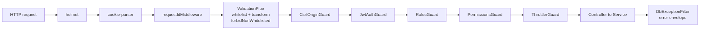
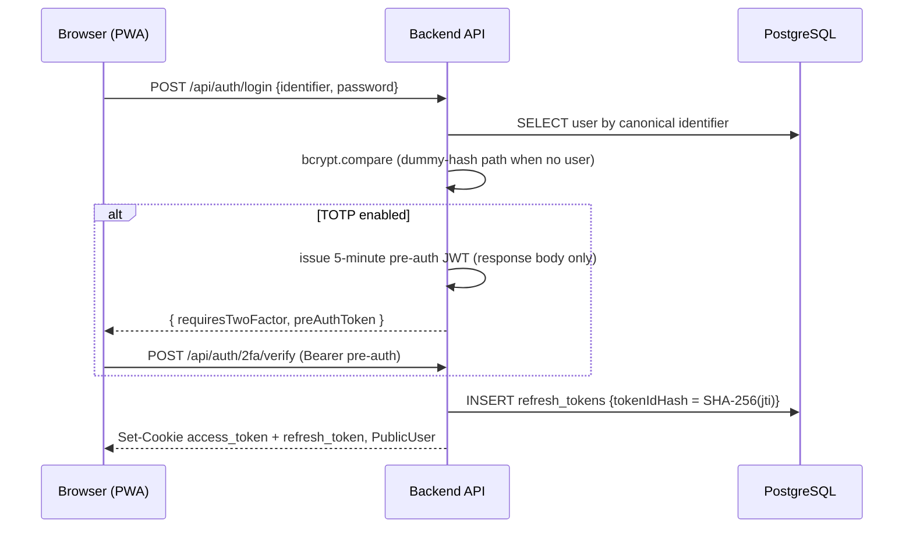
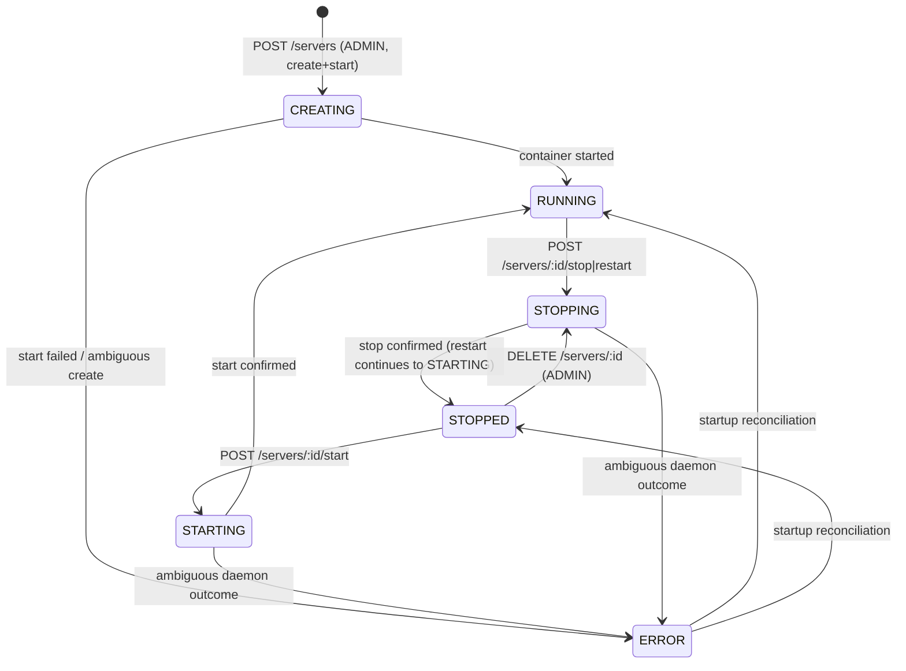
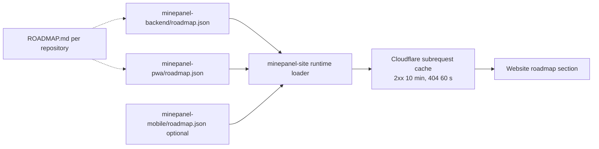
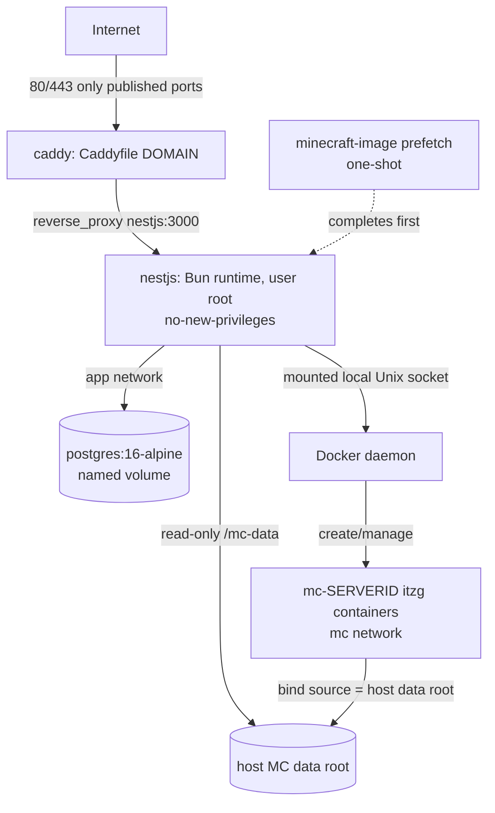

# MinePanel — Architecture

## 1. Scope and authority

This file describes **how the currently implemented MinePanel system is built**. It is the second
canonical document after [`SPEC.md`](./SPEC.md):

| Document | Answers |
|----------|---------|
| [`SPEC.md`](./SPEC.md) | What the system is required to do (contracts, invariants, decisions, status markers) |
| `ARCHITECTURE.md` (this file) | How the current implementation satisfies those contracts |
| [`ROADMAP.md`](./ROADMAP.md) | What is planned, deferred, conditional or exploratory |
| [`DEVELOPMENT.md`](./DEVELOPMENT.md) | How to build, test and validate changes |

This document describes **currently implemented** structure and therefore tracks the actual codebase; anything not implemented today is out of scope here and belongs to `ROADMAP.md` — including the Elysia 2 port, MCP, and the public documentation site. When this file and the code diverge, that is a documentation defect to fix here, or an implementation/contract discrepancy to classify in `SPEC.md` §1 — not a reason to change code to match prose.

---

## 2. Repository map

The project is three independent Git repositories under the `MinePanelProject` organisation. There is
no monorepo, no shared package, and no shared build: compatibility is maintained through protocol
versioning and capability discovery (§8), not through a shared workspace.

| Repository | Component | Stack | Canonical documents |
|------------|-----------|-------|---------------------|
| `minepanel-backend` | Operator-owned API: authentication, authorization, persistence, Docker orchestration, realtime host metrics | NestJS 11, TypeScript 5, Bun 1.3.14, PostgreSQL 16, Drizzle ORM 0.45, Socket.IO 4, Dockerode | `SPEC.md`, `ARCHITECTURE.md`, `ROADMAP.md`, `DEVELOPMENT.md`, `docs/*` |
| `minepanel-pwa` | Hosted dashboard (`app.minepanel.xyz`), a static client that talks to operator-selected backends | React 19, Vite 7, TypeScript 5, Tailwind 4, React Router 7, TanStack Query 5, socket.io-client | `SPEC.md`, `ROADMAP.md`, `DEVELOPMENT.md`, `README.md` |
| `minepanel-site` | Public marketing site (`minepanel.xyz`) | SvelteKit 2, Svelte 5, adapter-cloudflare, Cloudflare Pages | `README.md`, `docs/deployment.md` |

**Ownership boundaries.** The backend owns backend behaviour and deployment. The PWA owns dashboard
behaviour. The site owns public presentation content and owns no implementation progress: it renders
`roadmap.json` published by the implementation repositories at request time (§9.3).

No `minepanel-mobile` repository exists. A mobile client and player portal are exploratory
(`ROADMAP.md` §7.3).

---

## 3. Backend component structure

```text
src/
  main.ts                 bootstrap, production preflight, boot migrations, global HTTP setup
  app.module.ts           module composition + global guard order
  app.controller.ts       GET /health, GET /api/info  (the only public root controller)
  setup/                  first-admin status and transactional bootstrap
  users/                  user lookup/update, public-user projection
  auth/                   session issuance/rotation, TOTP, Google identity, guards, DTOs
    guards/               JwtAuthGuard, RolesGuard, PermissionsGuard, PreAuthGuard
  admin/                  ADMIN user management, MOD permission grants
  servers/                lifecycle state machine, admission, visibility, access workflows
  docker/                 Dockerode boundary + managed-container guardrails
  gateway/                Socket.IO adapter, connection reservation, events gateway, host metrics
  db/                     sole Drizzle provider, schema, production migration runner
  common/                 decorators, guards, filters, logger, request-id middleware, utilities
drizzle/                  generated migrations 0000–0006 + metadata
test/                     e2e suites (live PostgreSQL, mocked Docker)
scripts/                  postbuild rewrite, CI contract checks, TOTP and Docker lifecycle smokes
tools/oxlint/anti-slop/   repository lint rules and their tests
docs/                     domain documentation (deployment, auth, access control, servers, realtime)
```

`AppModule` wires, in order: `ConfigModule.forRoot({ isGlobal: true })`, `ThrottlerModule`
(10 requests/60 s baseline), `DbModule`, `SetupModule`, `UsersModule`, `AuthModule`, `AdminModule`,
`DockerModule`, `ServersModule`, `GatewayModule`. `AppController` owns only the two public root
routes.

Global request pipeline (`main.ts` + `app.module.ts`), in execution order:



`trust proxy = 1` is applied to the HTTP adapter so that protocol/host detection and per-client
throttling see the real client behind Caddy. The WebSocket path bypasses Nest routing in the adapter
(§7) and does not use the `CsrfOriginGuard`; Socket.IO enforces its own Origin admission instead.

---

## 4. Persistence architecture

* **One schema file.** Every table, enum, relation and inferred row type lives in
  `src/db/schema.ts`; nothing else may declare a Drizzle table (`SPEC.md` §5, invariant 1).
* **One provider.** `DbModule` exports the `DRIZZLE` injection token and the `DrizzleDB` type. Tests
  inject a mock in its place.
* **Seven tables** — `users`, `refresh_tokens`, `oauth_challenges`, `setup_state`, `servers`,
  `server_access`, `mod_permissions`. Column-level truth, including nullable/`CHECK`/partial-unique
  constraints, lives in `SPEC.md` §6.1 and in `schema.ts`; this file does not mirror it.
* **Migrations** are generated by `drizzle-kit generate` into `drizzle/` and applied by
  `drizzle-kit migrate`. In production `main.ts` runs the full chain **before** the HTTP server
  listens, under advisory lock `7333`. Migrations are forward-only.
* Primary keys are `text` UUIDs generated by `crypto.randomUUID()`.

**Cross-cutting serialization keys.** Correctness under concurrency relies on PostgreSQL advisory
locks rather than application locks, because the deployment is single-process but not
single-request:

| Key | Owner | Protects |
|-----|-------|----------|
| `7330` | `SetupService` | First-admin bootstrap: re-read `setup_state`, insert ADMIN, set the flag |
| `7331` | `AdminService` | Role/status transitions, last-admin guard, MOD permission grants |
| `7332` | `ServersService` | Resource admission + create/start/restart state claims |
| `7333` | `runProductionMigrations` | Concurrent boot migration |

Every server state change is additionally a compare-and-swap `UPDATE … WHERE status = <expected>`
(and `containerId` when set); a zero-row result is a lost claim and yields 409 without touching
Docker.

---

## 5. Authentication and authorization architecture

The behavioral contract is `SPEC.md` §8 and §9. Structurally:



* **`AccessTokenService`** is the single access-token verifier for both HTTP (`JwtAuthGuard`) and the
  WebSocket gateway. It validates the JWT, enforces `type === 'access'`, and re-reads the user's
  current `status`, `role` and `mustChangePassword` from PostgreSQL on every verification, so a
  demoted, banned or stale token cannot outlive the database. It fails closed on database errors.
* **`JwtAuthGuard`** reads the `access_token` cookie, honours `@Public()`, and is the only owner of
  the forced-recovery route exception: a `temporaryAuth` token is accepted only for
  `PATCH /api/auth/password`.
* **`RolesGuard`** implements `@Roles()`; ADMIN bypasses, routes with no metadata pass.
* **`PermissionsGuard`** implements `@RequiresPermission()` against `mod_permissions`, resolving a
  scoped or global grant for the `:id` route parameter; ADMIN bypasses; database failure is a
  fail-closed 503.
* **`PreAuthGuard`** gates `POST /api/auth/2fa/verify` on the five-minute pre-auth Bearer token.
* **`CsrfOriginGuard`** rejects mutating requests whose `Origin` header does not match the canonical
  `CORS_ORIGIN` (or the API's own origin, which is what lets the Swagger UI work). Origin-less
  requests pass so CLI/automation clients keep working.
* **Refresh rotation** runs entirely inside one transaction keyed by the SHA-256 digest of the JWT
  `jti`: read the row, delete it with `RETURNING`, insert the successor. Concurrent rotations of the
  same token therefore produce exactly one successor (`SPEC.md` §8.3).
* **Google identity** is split into `oauth-challenge.service.ts` (single-use, hashed, 5-minute
  challenge bound into the Google `nonce`), `google-token.service.ts` (local JWKS verification of the
  ID token) and `identity.service.ts` (link/login decision, including the
  `LinkConfirmationRequired` refusal to silently link by email match).

---

## 6. Docker boundary and server lifecycle architecture

### 6.1 Docker module

`DockerModule` constructs one Dockerode client over a **local Unix socket only** (`DOCKER_SOCKET`,
default `/var/run/docker.sock`) with the ambient `DOCKER_HOST` suppressed. Daemon absence is not
fatal at startup: the module logs and continues in degraded mode. `DockerService` is the only place
that talks to the daemon; the managed-container specification (image, labels, env whitelist, binds,
port mapping, memory, CPU/PIDs limits, capabilities) is normative in `SPEC.md` §10.3.

Two distinct data views exist for one physical data root: `MC_DATA_BIND_SOURCE` (host path passed
verbatim to the daemon and bound into each Minecraft container) and `MC_DATA_PATH` (the fixed
`/mc-data` path inside the backend, mounted read-only and used for `statfs` disk admission). The
contract is `SPEC.md` §10.2.

### 6.2 Lifecycle



Transitions, preconditions and failure classification are normative in `SPEC.md` §11;
`ServersService` owns them and `ServersController` is a thin adapter. The notable structural choices:

* **Admission before mutation.** Disk (`statfs` on `/mc-data`) and memory (sum of `memoryLimitMb`
  against `docker.info` total × `MAX_MEMORY_RATIO`) are evaluated before the state claim, with
  operation-specific summation (`SPEC.md` §11.4).
* **Graceful stop without a TCP RCON service.** The backend is deliberately not attached to the
  Minecraft container network; it warns players and flushes the world by running
  `docker exec … rcon-cli …` through the Docker boundary, then issues `docker stop`. RCON failure
  degrades to a direct stop.
* **Startup reconciliation** (`OnModuleInit`) inspects every non-`STOPPED` row, falls back to the
  `minepanel.managed` label lookup for stale container ids, and writes only CAS-guarded updates. A
  daemon-unreachable pass makes no writes.
* **Deletion** removes the container and the database row and deliberately retains world data on the
  host (`SPEC.md` §11.6).

### 6.3 Server visibility and access

Visibility is a SQL predicate shared by the row query and the count in `GET /servers`: ADMIN sees
every non-`CREATING` row; otherwise a row is visible when `accessType = 'OPEN'` or an `APPROVED`
`server_access` row exists for the caller. Non-visible rows are indistinguishable from missing
(404, never 403). `ownerId` records the creator and grants no visibility. Grants and requests are
race-safe through a unique constraint plus `ON CONFLICT` and bounded retry. See `SPEC.md` §9 and
`docs/access-control.md`.

---

## 7. Realtime architecture

`GatewayModule` owns the Socket.IO boundary and consists of four pieces:

| Component | Responsibility |
|-----------|----------------|
| `SocketIoAdapter` | Origin admission on the Engine.IO handshake, header-size limits, reservation-cap admission |
| `SocketReservationService` | Bounded pending-connection counter (cap 100) preventing pre-auth connection floods |
| `EventsGateway` | Handshake authentication (cookie, or one `auth` event within 5 s), ADMIN-only eligibility, per-tick re-validation, room membership |
| `SystemMetricsService` | Shared 10-second host-metrics collection and volatile broadcast of `system.stats` |

One shared interval serves all connected ADMIN sockets, so adding sockets adds no Docker calls. The
payload is host telemetry only and is never used for authorization. The event set is intentionally
minimal; server status/log/console events are Phase 3 work (`ROADMAP.md` §5). See
`docs/realtime.md` and `SPEC.md` §7.7.

Known limitation recorded in `SPEC.md` §7.7 and decision **D-6**: browsers cannot read the HttpOnly
access token, so the `auth`-event fallback is unusable for them, and the adapter's exact-Origin
admission rejects cookie-carrying handshakes with no `Origin`. A one-time WebSocket ticket is the
accepted but unimplemented fix.

---

## 8. Protocol and capability negotiation (backend ↔ PWA)

`GET /api/info` is the version-independent contract between a hosted client and an arbitrary
self-hosted backend. Clients MUST branch on capability flags, never on `version`.

| Flag | Current value | Meaning |
|------|---------------|---------|
| `api.protocolVersion` | `1` | Wire protocol generation |
| `capabilities.auth.partitionedCookies` | `true` | Production session cookies are CHIPS `Partitioned` |
| `capabilities.auth.pkceAuthorizationCode` | `false` | No authorization-code/PKCE flow exists |
| `capabilities.auth.googleOAuth` | from `GOOGLE_CLIENT_ID` | Google ID-token login is configured and usable |
| `capabilities.realtime.websocketTicket` | `false` | WebSocket ticket flow not implemented |
| `capabilities.servers.requestableDiscovery` | `true` | `GET /api/servers/requestable` is available |

Consumers in `minepanel-pwa`: `session-controller.ts` refuses a panel whose protocol is not 1 or
that does not advertise partitioned cookies; `supportsGoogleLogin()` and
`supportsRequestableDiscovery()` gate their respective surfaces; the realtime hook requires
`partitionedCookies && !websocketTicket`; `setup-page.tsx` requires the same capability pair.
`capabilities.servers` is optional on the wire so that older protocol-1 backends remain fully usable
with only discovery disabled.

Adding a capability is the supported way to ship a client feature that depends on new backend
behaviour. Removing or repurposing a published flag requires a protocol version change, which is
also why the Elysia port MUST keep `protocolVersion` unchanged (`ROADMAP.md` §6.1).

---

## 9. Client architectures

### 9.1 Hosted dashboard (`minepanel-pwa`)

```text
src/
  api/         typed backend client, error mapping, DTO validators, TanStack query keys
  auth/        session controller, Web-Locks refresh broker, cross-tab channel, Google identity
  instances/   strict origin validation + IndexedDB metadata registry (server-side-free)
  pages/       registry, auth/account/security, setup, servers, access, admin
  components/  app frame, panel shell, shared UI primitives
  realtime/    cookie-first socket.io host-metrics client
  pwa/         service-worker registration and update prompt
```

Layer rules that matter architecturally:

* **Browser-to-backend direct.** Cloudflare Pages serves static assets only. There is no proxy,
  relay, or centralized MinePanel API; every authenticated request from the browser goes straight to
  the operator-selected origin with `credentials: 'include'`.
* **Session authority.** `session-controller.ts` is the only component allowed to mutate session
  state; `refresh-broker.ts` serializes refresh rotation across tabs with a per-origin Web Lock and
  refuses to refresh when Web Locks are unavailable. A failed refresh proves the session is
  terminally invalid and triggers the panel-scoped teardown callback.
* **Registry contains metadata only** — canonical origin, optional label, timestamps. No token,
  cookie, credential, capability response, or backend data is persisted by the client.
* **Strict origin validation** (`instances/origin-validation.ts`) accepts only a browser-trusted
  public HTTPS origin; HTTP, paths, credentials, literal IPs, `localhost`, `.local` and
  `.localhost` are rejected outside development builds.
* **Caching boundary.** The service worker precaches same-origin application assets only. There is
  no runtime cache, offline mutation queue, or WebSocket interception; backend operations require the
  network.

### 9.2 Public site (`minepanel-site`)

SvelteKit with `adapter-cloudflare`. Static presentation content is owned locally in typed
TypeScript (`src/lib/data/site-content.ts`) and therefore requires a site deployment to change. The
homepage route opts out of prerendering (`prerender = false`) because `+page.server.ts` fetches and
validates roadmap JSON at request time; rendered responses are `no-cache, must-revalidate` so a fresh
deployment is visible immediately, and only the roadmap `fetch()` subrequests are cached at the
Cloudflare subrequest layer (`cf.cacheEverything` with `cacheTtlByStatus`: 2xx 10 minutes, 404 60 s,
5xx never). `/privacy` stays prerendered. Failures are isolated per roadmap source so one unavailable
repository degrades only its own section. The browser never calls GitHub.

### 9.3 Roadmap data flow



`roadmap.json` is a published projection of each repository's `ROADMAP.md`; the human-readable
rationale lives in `ROADMAP.md` and the machine-readable progress lives in `roadmap.json`
(`ROADMAP.md` §1.1). Mobile has no repository, so its entry resolves as "not published".

---

## 10. Deployment architecture



| Service | Notes |
|---------|-------|
| `nestjs` | `pull_policy: missing`; `expose: 3000` only; `user: root`; `security_opt: no-new-privileges`; healthcheck `/health`; depends on healthy PostgreSQL and the completed prefetch |
| `postgres` | named volume, no published ports, `pg_isready` healthcheck |
| `caddy` | publishes 80/443 (+443/udp), automatic HTTPS from `DOMAIN`, proxies to `nestjs:3000` |
| `minecraft-image` | one-shot prefetch of the exact `MINECRAFT_IMAGE` identity used by managed containers |

The backend holds no membership in the Minecraft `mc` network; it reaches containers through the
Docker socket and `docker exec`. Compose is the shipped deployment contract; the operator
prerequisites, update path and release channels are documented in
[`docs/deployment.md`](./docs/deployment.md) and `SPEC.md` §4.

Release flow: CI publishes `edge` and an immutable `sha-<40-char>` tag on every `master` push, and
`X.Y.Z`/`X.Y`/`X`/`latest` plus the SHA tag on a `vX.Y.Z` tag. Deployment assets are fetched from a
versioned raw GitHub ref so the Compose file, `.env.example` and `Caddyfile` match the image.

---

## 11. Trust boundaries (summary)

The normative, per-boundary statement with hard prohibitions is `SPEC.md` §4.2. Architecturally:

1. Internet reaches only Caddy; the backend port and PostgreSQL are never published.
2. Caddy → backend is plaintext HTTP on the `app` bridge with a single-host assumption, which is why
   `trust proxy = 1` is valid and why publishing the backend port would silently break both per-IP
   throttling and the CSRF origin check.
3. Mounting the Docker socket gives the backend root-equivalent host authority; the managed
   container guardrails are defense-in-depth, not a real boundary.
4. Minecraft containers run untrusted modded game code unprivileged, memory/CPU/PID capped, with no
   added capabilities. Inter-container traffic on the `mc` bridge is currently unrestricted
   (backlog B-P2-4).
5. The backend data mount is read-only; filesystem mutation is blocked until decision **D-8**
   selects a write architecture (`SPEC.md` §10.4).

---

## 12. Error and observability architecture

* Every request gets a server-trusted correlation id: a bounded `X-Request-Id` is honoured, anything
  malformed or oversized is replaced with a UUID, and the chosen id is echoed on the response.
* `requestIdMiddleware` and `CustomLogger` emit structured `http.request` / `http.error` events.
* The global `DbExceptionFilter` maps PostgreSQL SQLSTATEs to HTTP responses; services do not
  duplicate SQLSTATE handling.
* Application errors share one envelope (`statusCode`, stable machine `error`, human `message`,
  bounded `details`, `requestId`). Domain codes (auth/session, `InsufficientResources`, CSRF) are
  preserved; everything else maps to status-based codes. Internal details, SQL, Docker errors,
  stack traces, secrets and filesystem paths are never returned.
* Logging is Nest's `ConsoleLogger` subclass — there is no `nestjs-pino`, structured log shipper, or
  metrics backend, and no tracing. The only external observability surfaces are the structured
  console events and `GET /health`.

---

## 13. Validation and release gates

The authoritative list of CI jobs, what each runs and which event gates it lives in
[`SPEC.md`](./SPEC.md) §14.2. The per-change local expectations live in
[`DEVELOPMENT.md`](./DEVELOPMENT.md) §6.

Structural facts worth knowing here:

* The `test` job is the read-mostly gate (typecheck, anti-slop lint, Biome, build, unit suites, both
  contract scripts, rule tests, the compiled TOTP seam smoke). `migration`, `e2e` and `image` add the
  live-database, mocked-Docker and image-scanning boundaries.
* `trusted-lifecycle` and `publish` are the only daemon-backed jobs and they run on `master` pushes
  and release tags, never on pull requests.
* CI paths-ignore lists mean a documentation-only change runs no backend or PWA job, so it must be
  validated locally instead of inheriting a green check.
* The PWA runs `typecheck`, `lint`, `test` and `build` on PRs and `master` pushes; the site's only
  automated gate is the Cloudflare Pages build from `main` (`bun run check` and `bun run parity` are
  local-only).
